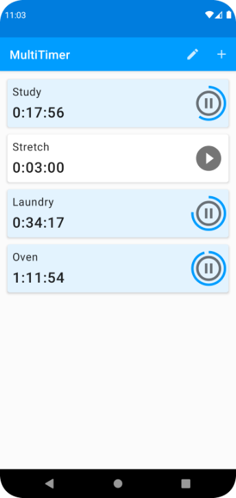
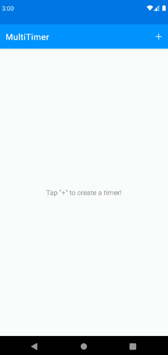
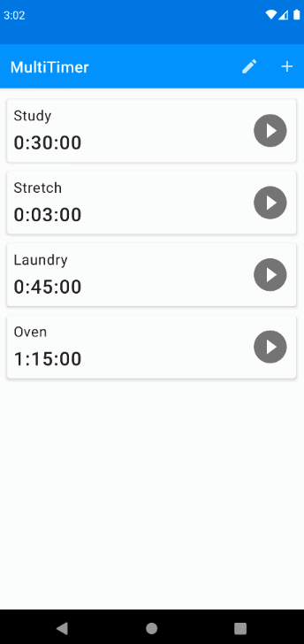

# MultiTimer
MultiTimer is an Android application allowing users to run multiple named timers concurrently or sequentially:

## Using the App

#### Adding/Editing a Timer
To create a new timer, tap the "+" icon in the toolbar. On the "Add Timer" screen, input a timer name and duration (up to 24 hours).

To edit an existing timer, tap the edit icon in the toolbar of the timer list view, then select the timer in the list.

#### Modifying the Timer List
To delete timers, tap the edit icon in the toolbar, then tap the delete icon (red trashcan) on the timers to remove.

To reposition a timer in the list, tap and hold a timer, then drag it to the desired position in the list. Alternatively, tap the edit icon in the toolbar, then use the drag handles to more quickly reposition multiple timers.

#### Timer Finished
When a timer finishes, a notification appears specifying the finished timer's name. The finished timer also displays differently in the timer list until the user resets it.

#### Application Screenshots
|                                             Add/Edit Timer                                             |                                                                 Reposition Timer                                                                 |                                                     Timer Finished                                                     |
|:------------------------------------------------------------------------------------------------------:|:------------------------------------------------------------------------------------------------------------------------------------------------:|:----------------------------------------------------------------------------------------------------------------------:|
|  |  |  |

## Project Setup
Clone this repository, import the project into Android Studio, and run the app on an Android device or emulator (minimum SDK 26). Verified on Android Studio Bumblebee (2021.1.1).

## Architecture Overview
MultiTimer's architecture is straightforward. A single [MainActivity](app/src/main/java/io/clfm/multitimer/ui/MainActivity.kt) which hosts two fragments, [TimerListFragment](app/src/main/java/io/clfm/multitimer/ui/TimerListFragment.kt) and [AddOrEditTimerFragment](app/src/main/java/io/clfm/multitimer/ui/AddOrEditTimerFragment.kt). The fragments both use [TimerViewModel](app/src/main/java/io/clfm/multitimer/ui/TimerViewModel.kt), which serves as a repository for both persisted and transient timer state. Timer data is persisted in a SQLite database via Android Jetpack's Room library. Notifications are managed by the [notification](app/src/main/java/io/clfm/multitimer/notification) module.

## Author's Note
MultiTimer is currently intended for personal use; it is not fully-featured or published to the Google Play store.
